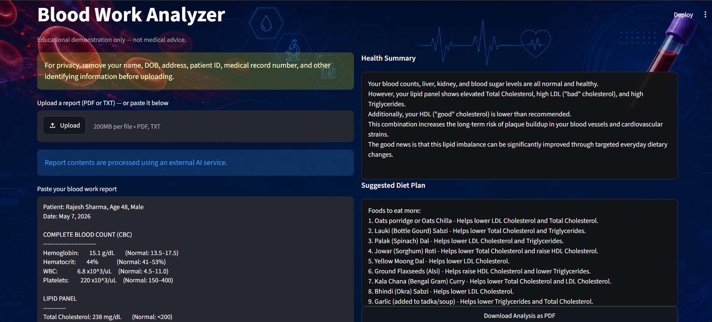

# Blood Work Analyzer

A Streamlit-powered web site that analyzes blood work reports using a two-stage LLM pipeline and provides personalized health summaries with Indian diet recommendations.



---

## What It Does

Paste or upload a blood work report (PDF/TXT), and the app:

1. **Extracts** every test value and classifies it as HIGH, LOW, or NORMAL based on reference ranges
2. **Generates** a plain-language health summary explaining what the results mean
3. **Recommends** a practical Indian diet plan — specific foods to eat more of and foods to avoid, tied to actual blood values

Built with a two-stage LLM pipeline: the first call parses the raw report into structured data, the second uses that structured data to produce actionable health and diet advice.

---

## Tech Stack

- **Frontend:** Streamlit
- **LLM Integration:** LangChain + Google Gemini (gemma-4-31b-it)
- **PDF Processing:** PyPDF, FPDF2
- **Package Management:** uv
- **Deployment:** Streamlit Community Cloud
- **Language:** Python 3.14

---

## Project Structure

```
langchain-project/
├── health_analysis/
│   ├── streamlit_app/
│   │   └── app.py                # Main Streamlit application
│   ├── bloodwork_analysis.ipynb  # LLM experimentation notebook
│   └── blood_work.txt            # Sample blood work report
├── llm-calling/
│   └── call_llm.ipynb            # LLM calling experiments
├── .env                          # API keys (not in repo)
├── .gitignore
├── CLAUDE.md                     # Build instructions for Claude Code
├── pyproject.toml                # Project config and dependencies
├── requirements.txt              # For Streamlit Cloud deployment
├── uv.lock                       # Dependency lockfile
└── README.md
```

---

## Getting Started

### Prerequisites

- [uv](https://docs.astral.sh/uv/getting-started/installation/) (Python package manager)
- A Google AI API key ([get one here](https://aistudio.google.com/apikey))

### Installation

1. **Clone the repo**
   ```bash
   git clone https://github.com/Shreya-bristi/blood-work-analyzer.git
   cd blood-work-analyzer
   ```

2. **Install dependencies** (uv handles Python version and virtual environment automatically)
   ```bash
   uv sync
   ```

3. **Set up environment variables** — create a `.env` file in the project root:
   ```
   GOOGLE_API_KEY=your_google_api_key_here
   GROQ_API_KEY=your_groq_api_key_here
   ```

4. **Run the app**
   ```bash
   uv run streamlit run health_analysis/streamlit_app/app.py
   ```

5. Open `http://localhost:8501` in your browser.

---

## How It Works

### Two-Stage LLM Pipeline

**Stage 1 — Extraction:** The raw blood report text is sent to the LLM with instructions to extract every test value and classify it against its reference range. Output is structured as: `Test Name | Result | Unit | Status | Reference Range`.

**Stage 2 — Analysis:** The extracted and classified values are sent to a second LLM call that acts as a clinical nutritionist specializing in Indian diets. It produces a health summary in simple language and a diet plan with specific, affordable Indian foods mapped to the blood values they help improve.

### Input Options

- **Paste** a text blood report directly into the text area
- **Upload** a PDF or TXT file containing the report

### Privacy

- Report contents are processed via an external AI service (Google Gemini API)
- No data is stored — reports are processed in memory and discarded after analysis
- Users are advised to remove personal identifiers before uploading

---

## Sample Input

```
Patient: Rajesh Sharma, Age 48, Male
Date: May 7, 2026

COMPLETE BLOOD COUNT (CBC)
--------------------------
Hemoglobin:     15.1 g/dL     (Normal: 13.5–17.5)
Hematocrit:     44%

LIPID PANEL
-----------
Total Cholesterol: 238 mg/dL  (Normal: <200)
LDL Cholesterol:   162 mg/dL  (Normal: <100)
HDL Cholesterol:   36 mg/dL   (Normal: >40)
Triglycerides:     188 mg/dL  (Normal: <150)
```

---

## Development

### Running the notebook

```bash
uv run jupyter notebook
```

Open `health_analysis/bloodwork_analysis.ipynb` to experiment with prompts and LLM calls.

### Adding dependencies

```bash
uv add package-name
```

---

## Built With

This project was developed as part of the [Codebasics](https://codebasics.io/) Agentic AI crash course. The Streamlit app was collaboratively built using [Claude Code](https://docs.claude.com/en/docs/claude-code), with prompts and LLM experimentation done manually in Jupyter notebooks.

---

## License

This project is for demonstration purposes.
